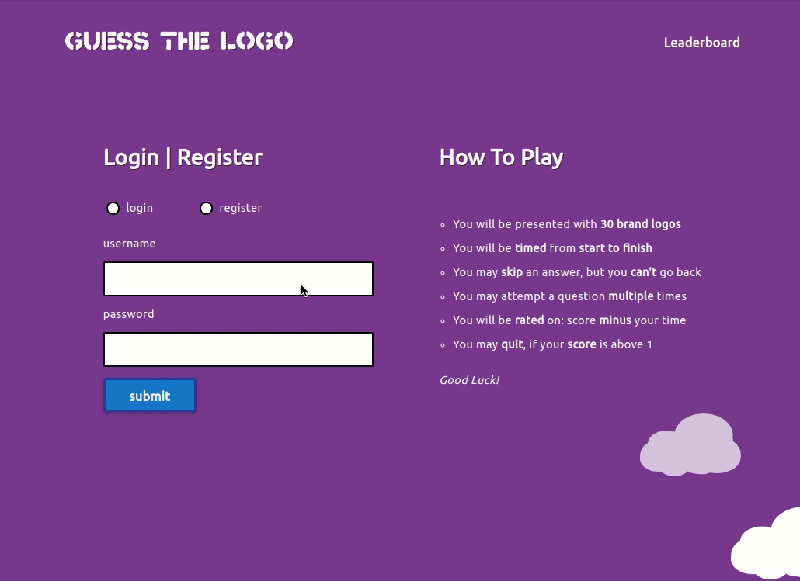
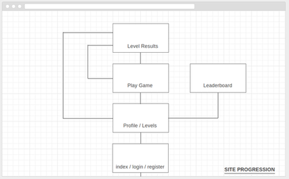

## GUESS THE LOGO QUIZ
---
Python & Flask - Milestone Project 3 for Code Institute by Sean Murphy

## Project Summary

Guess the logo is a fun, interactive and engaging logo guessing game.  
The quiz is comprised of 30 questions which you will be presented with in a random order each game.  
Your final score will be calculated on your correct answers minus your time played.  
When the game is over you will be able to compare your scores on the leaderboard against other players and your statistics will be saved for your next login.  
On returning to the home screen you may begin another game to improve your score.  
*Good Luck!*

---

## UX

Before embarking on full blown development, I created a site progression scheme which would dictate the user flow and outline which direction the user was allowed to travel.  

The Navigation system would be near obsolete as I wanted the user to go through the flow of registering, seeing their profile, playing the game and finally viewing the leaderboard.  Although this flow is not restricted and the user may generally move freely around the site.  

#### Colours, Design & UX  

I wanted the colours, design and interface to mimic a mobile application, it not should be overly distracting, it should be calm but yet engaging. There are many quiz sites on the internet I browsed through but found that most of them were extremely cluttered.  

Happy with my choice, I have designed a site with big and bold font, outlines and a color scheme that is consistent throughout. Various shades of purple are used to distinguish between regions, and notifications are in a black popup that cant be missed.   

Throughout the game I have implement score and time tracking, which I think is both a bonus and reminder to the user of how they are getting on in the quiz. On the second playthrough, the leaderboard will show your highest score as well as the score of your last played game. Rules of the game are presented upon landing on the site and login.

#### User Stories
- As a user ... It must be immediately obvious to a new user how to navigate the site and how to play the game
- As a user ... I can create a user profile, and log in and out
- As a user ... My scores will be saved should I want to return and play again
- As a user ... If I dont know an answer I can skip that question 
- As a user ... If I get an answer wrong, I will be notified of my error
- As a user ... If I wish to end the game, I may do so with reaching the final question
- As a user ... I want to game, layout and design to keep me engaged and to be fun to play 
- As a user ... I want to be able to see my current games time and score
- As a user ... I want to be ale to compare my results to other users

  
##### UX Walkthrough

##### Sample Error Page

##### Site Progession.png

##### Clouds

  

---  

## Features  

**Page: Index:**

*Login / Register Logic:*
1. The index page serves as both a login / register page with rules information  
   - The user must first register, if already register the user must login
   - Open the users.json file as `'r+'`, try to find a user by that username
   - If a user is found, check the `hashed password` matches the form password.
   - If all is good return the user `dict` and initalise the game and user variables, if not return `False`
   - if a users password is incorrect or the username does not exist,   `flash` an `error`.
   - if registering for the first time, check for that username, if it exists, flash an error, otherwise import the user model, assign the username and `hashed password` and `append` the new user to both the `users.json` and `leaderboard.json` files. 

   Password hashing was implementted with `werkzeug.security` using both `generate_password_hash` and `check_password_hash`

2. The index page serves as a profile page from which to start a new game. Session Variables are both reset and initalised on load. In place of the login / register form the user will be presented with their scores if any and a play game button. Implement the last played game was tricky when using `datetime.utcnow()` as it was an invlid format to write to the json file to save. Instead I converted to a string using `datetime.strftime(datetime.utcnow(), '%a, %d %b, %H:%M')`  which formats the date like `Fri, 14 Dec, 12:51`. The reference I used was https://docs.python.org/2/library/time.html

3. The User Icon in the right hand corner will be visible `if 'user' in session` and will display the users best score, time and rating and also provides a link to the `@app.route('/logout)` to logout the user by clearing all session variables including the user itself.

**Page: Game:**

The game function required the most use of session variables to initalise and track a users scores and times. At the beginning of a game the game data is fetched from `game.json`, and returned shuffled for each new game. If it is a new game a timer will start which is tracked on each page refresh.   

A small JavaScipt function mearly increases the timer on the page for visual purposes but ttime is tracked using `session['current_time'] = round(time.time() - session['start_time'])`.

Session variables are also passed to the game.html template to give the user a indication of correct answers and remaining questions.

The game.html template will display the correct question as `index - 1` is passed to the image src for example `{{ url_for( 'static', filename=session.game[session.index - 1].image_url ) }}"`. Image names have been changed to prevent seeing the answer by alt or right-click.

On form submit, the answer will be checked, if correct index is increased and the next page will render. If incorrect the page will refresh and an error message with the incorrect answer will be show.  

Users also have the choice to skip a question. When all questions have been presented, the user will be redirected to the leaderboard page for their results.

**Page: Leaderboard:**

The leaderboard is created using a table, making it responsive to 100%. Due to heroku's ephemeral filesystem, I decided to show all users on the table, so right now it is infinite in length, but will never grow out of control. When the leaderboard is requested I call `get_leaderboard()` in helpers.py. Which opens the `leaderboard.json` file and uses a `lamda` function to sort users ranked by highest_rating in reverse order. If this is a second playthrough it will also return (only in memory) the **last played** game results as well as **highest_rating** for the user. If a new Highest Rating is achieved then it will find the user and write the new scores to file.

**Page: Errors:**  

To handle `page not found` and `internal server` errors I created 404 and 500 page errors using font-awesome, css keyframes and in errors.py I used `@app.errorHandler` routes to serve the templates. 

**Clouds Animation:**  

The clouds animation that appears globally on mouse capable devices and screens above 1204px in width. Was inspired from the codepen at https://codepen.io/P3R0/pen/RPbgaX. This is not a direct copy but instead learned from and create a functionally similarly animation. I created the cloud in [Krita](https://www.krita.org/en) and seperated the css into a seperate file with a media rule of `(hover:hover)`    

**Bugs:**

1. On small devices, `body-x: overflow` on clouds is an issue, solution is to not show clouds on small devices.
2. For some unknown reason, on heroku after login, the site switchs to making requests via http instead of https. No non-secure assets are being called, all links are relative. A Code Institute Tutor was unable to help me resove the situation at the time.  
My solution was to install [SSLify](https://github.com/kennethreitz/flask-sslify) which detects non-secure requests and redirects to a secure url.
3. Pressing the back button after finishing a game returns a user to the last question. I had tried to prevent this with `request.referrer` but since using SSLify the request appears as being from `None`. So a little bug, but bn too bad.
4. A bug that seems to have resolved itself was when a user ends the game early if no scores at all were gained, when writing to the leaderboard.json file, an extra `}` would be appended to the file.  
    1. I added  `if session['current_score'] > 0:` only then should json file be written too.
    2. I think the file was trying to write data with partially existed. The situation seems to have been fixed.
5. In some cases I needed to use `!important` in my css styles to overide some of the micro css framework styles.

---

### Features Left to Implement

- I would have liked to create multiple levels that the user would choose from ttheir profile page. But it seemed to much for the projects criteria.
- I would have liked to also create a hint system where users could forfeit a time penalty to get a partial answer.
- In place of using an input, to possibly have a list of shuffled characters contains all correct characters needed as well as extra redundent characters. The user would have to assemble the word, a bit like scrabble.

---

### Application Structure:

To keep the application as tidy and organised as possible I have structed the filesystem as follows. I felt that having the main application in a sub folder as a module was a better option. run.py is simply a placeholder linked to init.py in the app folder.

app: *contains main pyhon logic, views and helpers*   
data: *contains all json files*  
static: *contains images, css, javascript, fonts*  
templates: *contains errors, partials and main html files*  
test: *contains pytest python test file*

*app*  
- *data*
- *static* 
- *templates*  
__init__.py  
errors.py  
forms.py  
helpers.py  
routes.py  

*test*

config.py  
run.py

---
## Technologies Used

> *Python, Flask, Jinja, Flask-WTF, SSLify, Selenium, ChromeDriver, JavaScipt, JSON, CSS, Git, Heroku*  
 
- Python  
https://docs.python.org/3/  
*time, math, json, random, shuffle, datetime, os*  
Python is used as the backend language for created helper functions, logic and routes  
Various modules were used to assist with parsing, math operations and file manipulation

- Flask  
http://flask.pocoo.org/  
*render_template, redirect, url_for, session, request, flash*  
Flask was used as a micro framework for constructing a backend.   
It also provided useful functions that I could use to help with routing, errors and messages.

- Jinja  
http://jinja.pocoo.org/  
Jinja is the templating language used by flask. I made a lot of use of jinjas if statements, loops and ability to construct partial templates.

- Flask-WTForms  
https://flask-wtf.readthedocs.io/en/stable/  
*werkzeug.security, generate_password_hash, check_password_hash , wtforms, wtforms.validators*  
I have used flask-wtf to perform form creation, partial clien-side validation, and similarly realted - `werkzeug.security` to created and validate hashed passwords.

- Pytest  
https://docs.pytest.org/en/latest/  
Pytest was used for automated testing of about half of thhe application. I usedthe ability to create fixtures of reusables function and used asserts to validate responses.

- SSLify  
[https://github.com/kennethreitz/flask-sslify](https://github.com/kennethreitz/flask-sslify "SSLify")  
SSLify was used to correct and ensure that all requests were carried out over secure `https`, as I had some unresolvable issues on heroku.

- Selenium  
[https://www.seleniumhq.org/](https://www.seleniumhq.org/ "Selenium")  
Selenium is a tool to control the automation of web browsers. It was used in conjuction with chromedriver to perform a live run through and testing of the application.

- JavaScript  
https://www.ecma-international.org/  
I have used vanilla JavaScript to perform some aesthetic changes to the DOM, as per guidelines, no logic has been performed withh JavaScript. Initially I loaded jQuery via CDN but I did not consider its use in one function to warrent its inclusion, so it was removed and the function was re written in pure JavaScript.

- JSON  
https://www.ecma-international.org/  
JSON is used as the primary data structure that would hold all written models, scores, leaderboard and users.

- CSS, Flat-Remix  
http://www.w3.org/Style/CSS/members  
https://drasite.com/flat-remix-css  
I have used plain CSS for all positioning and styling of the site, flexbox was used heavily in places as with as relative and absolute positioning.  
I have used Flat Remix micro framework to as a base on which to style my elements. The only elements that made use of Flat Remix were buttons and inputs.

- Font-Awseome
https://fontawesome.com/  
Font Awseome is used through the site to create attractive icons, adds a nice touch.

---

## Testing

Testing was done in 3 different ways.  
1. Manual Browser Testing during develoment  
2. Automated written tests
3. User testing

#### Browser Testing

- During development I was testing each page from responsiveness and compatibilty on Firefox and Google Chrome.  
- Making sure elements behaved as expected, were consistent across browsers and responded to height and width changes correctly.  
- All elements accepted clicks and input if needed, that form autofocus worked correctly on mobile and desktop  
- When uploaded to heroku I was able to test mobile compatibility and that changing screen orientation also adjusted properly.
- `Print` and `console.log` were used often to see expected values
- Flask `debug=True` was used through development and used in conjuction to see error messages along side the terminal errors

####  Automated written tests

I begin testing the application witth `pytest` and soon after ran into an issue which I could not seem to find a solution for. I have used `flask sessions` throughout and obtaining the values proved unfruitful. However I wrote tests as follows:

*With pytest*

I first created `@pytest.fixture` functions to act as helpers to my tests so code would not written more than once.

- Tested that routes response status either was appropriate - some 200 (ok)and some 302 (redirect)- depending on that routes logic.
- Tested login and register responses for successful and unsuccess logins and registers by calling the correct helper function and analysing the responses.
- Tested that the leaderboard and users file return the correct reponse of a dict or False. 
- All tests passed

*To test the game itself*

To find a solution to automated testing of the app I used a python module called `Selenium` along with `chromedriver`, these two together would allow me to write a script which starts and controls Google Chrome browser via writen commands. I went through the following process:

*CSRF protection needed to be disabled  
Game shuffling needed to be disabled to input corrrect answers*

- with pytest - create a new user and store the user dict in a global variable
- started headless chrome
- load the index page
- login the created user by selecting page elements by id and inputing the username and password data 
- click play button, would be redirected to the game page
- create a loop which would send the answers to the game text input form and click submit
- after the loop finishes, wait some secs for the app to write new data to file
- load the route for logout and close down the chrome driver

After this automated run through I could compare to new users initial scores with the scores that have been written to file after a successful game play.

If the scores have changed and written to file -    
*All tests passed.*

####  User testing

- When the applicationn was nearly finished, a handful a Code Institute Students tested the heroku application and provide useful suggestions and insights and well as small bugs that I had missed. 
- This was invaluable feedback that helped me to ensure that the application once fixed was of an acceptable standard to real world users.

---

## Deployment 

I developed my site locally using visual studio code on on Arch Linux based distribution. The methods and commands outlined below may vary depending on your operating system.

#### Deployment to Heroku

In order the deploy my project to Heroku I have completed the following steps:

- Finalised all code, and made sure that it was production ready, removed any references to `debug=True` and ensured that my `.gitignore` was not uploading any `__pycache__`, `.env` files  or `venv` folders
- Created an account on heroku, created a new python project and linked my github
- Download and installed the `Heroku CLI` from Arch's Package Manager `Pacman` and signed into the `CLI` from `bash terminal`
- Created a `Procfile` with the command `echo web: python run.py > Procfile`
- Created a requirement.txt file so Heroku know what python modules it will need to run my application with the command `pip freeze > requirements.txt`
- Configured any envoirnment variables in Heroku App Settings > Config Vars such as my apps secret key, IP and PORT
- Made a final commit to git, and set another remote to heroku git with `git remote add heroku https://git.heroku.com/guess-the-logo.git`
- Push to heroku git with `git push -u heroku master`
- The application was now fully deployed

#### Setting my project up in a local development environment

Should you wish the run a local copy of this application of your local machine, you will need to follow the instructions listed below:

**Tools you may need:**   
Python 3 installed on your machine https://www.python.org/downloads/  
PIP installed on your machine https://pip.pypa.io/en/stable/installing/  
Git installed on your machine: https://gist.github.com/derhuerst/1b15ff4652a867391f03  
A text editor such as https://code.visualstudio.com/ Visual Studio Code  

- Obtain a copy of the github repository located at https://github.com/nazarja/guess-the-logo and clicking the download zip button and extracting the zip file to a chosen folder. Should you have git installed on your system you can clone the repository with the command `git clone https://github.com/nazarja/guess-the-logo.git`
- If possible open a termial session in the unzip folder or `cd` to the correct location
- Next your need to install a virtual environment for the python interpreter, the build into one will suffice, enter the command `python -m venv venv` . NOTE: Your python command may differ, such as `python3` or `py`
- Activate the venv with the command `source venv/bin/activate`, again this may differ depending on your operating system
- Upgrade pip locally by `pip install --upgrade pip`
- Install all required modules withh the command `pip -r requirements.txt`
- Its now time to open your text editor and create a file called `.flaskenv`
- Inside this file you will need to type `SECRET_KEY=YOU_WILL_NEVER_GUESS` and save that file
- Lastly, open run.py and on line 6 replace `0.0.0.0` with `127.0.0.1` and save the file
- You can now run the application with the command `python run.py`
- You can visit the website at `http://127.0.0.1:5000`

---

## Credits

### Content
- The `lamda` function in the leaders sort funtion was learned at [W3 Resource](w3resource.com)
- Inspiration and learning from but not a direct copy - the clouds animation was found at https://codepen.io/P3R0/pen/RPbgaX
- The css micro framework - [Flat Remix](https://drasite.com/flat-remix-css) - (he also does great work for the linux community)

### Media
- The clouds were created by myself in Krita
- Font-Awesome is used throughout the site for icons
- The favicon was found on google images

### Acknowledgements

- The Code Intitute Slack Community for pointing out errors, helping with user testing.
- In particular, a big thank you to `@2BN-Tim` for playing the game over 5 times. As a salute to tim I have hard coded his top score into the leaderboard.
- A thank you to my mentor `@ckz8780_mentor` for reviewing and also advise during and at the final stage of development.

